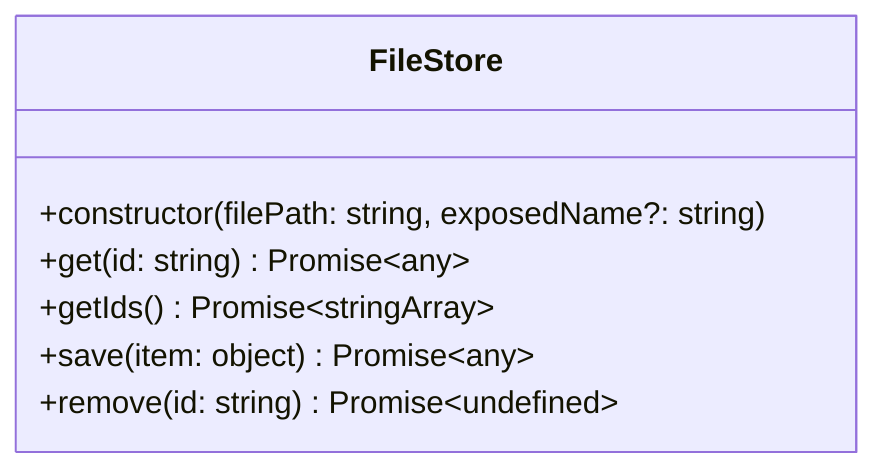

# electronade-filestore-util

It's a package that provides some utilities for [electronade-filestore](https://electronade-filestore.netlify.app/).

It's an optional module for `electronade-filestore` so `electronade-filestore` should be installed before using `electronade-filestore-util`.


[](https://www.npmjs.com/package/electronade-filestore-util)

## installation

``` shell
npm install electronade-filestore-util
```

## interfaces



## usage

import and use FileStore class in Renderer process.

``` typescript
import { FileStore } from "electronade-filestore-util";

const filePath = "path/to/store/file";
const fileStore = new FileStore(filePath);

const savedItem = await fileStore
  .save({ some: "thing" });

console.log(savedItem.some); // thing

console.log(
  await fileStore
    .get(savedItem._id)
    .then(({ some }) => some)
); // thing

console.log(
  await fileStore.getIds()
); // [ ...savedItem._id ]

console.log(
  await fileStore.remove(savedItem._id)
); // undefined
```
